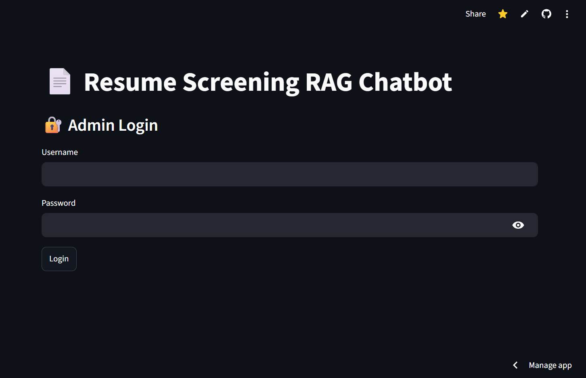
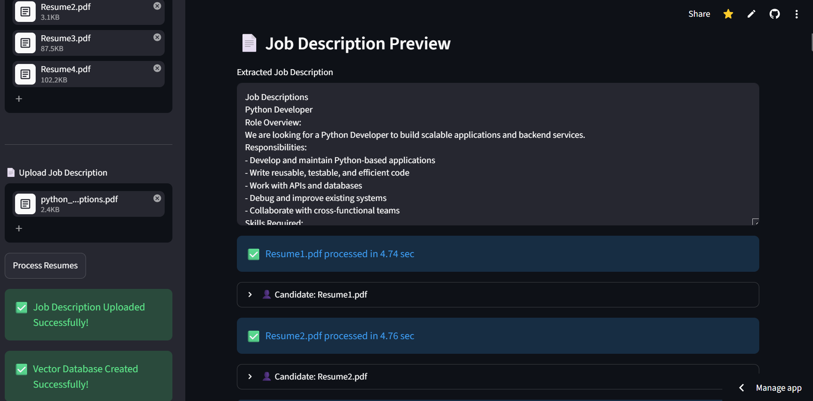
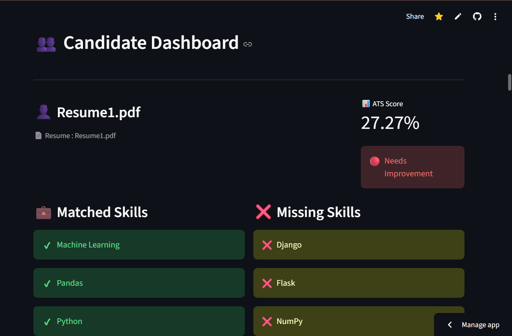
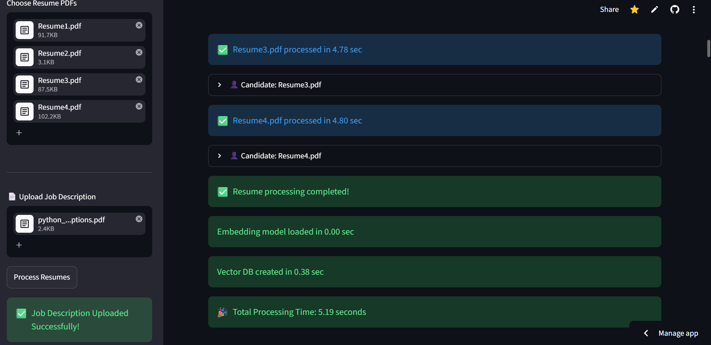
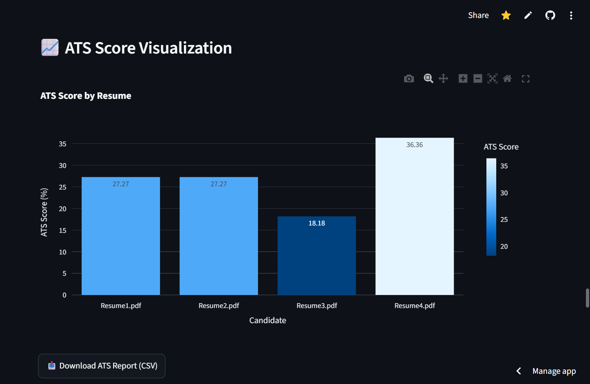
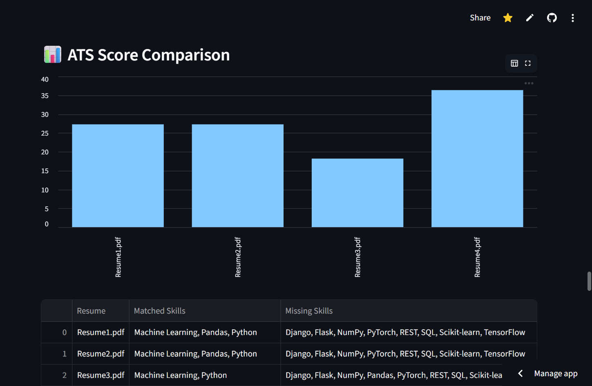
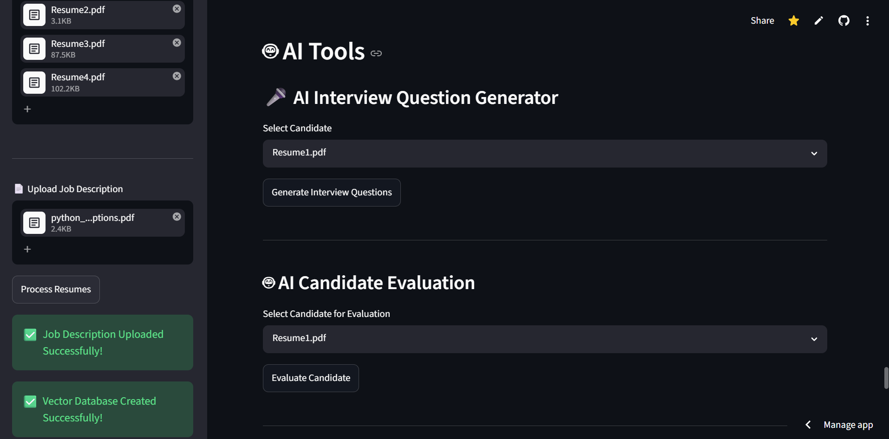
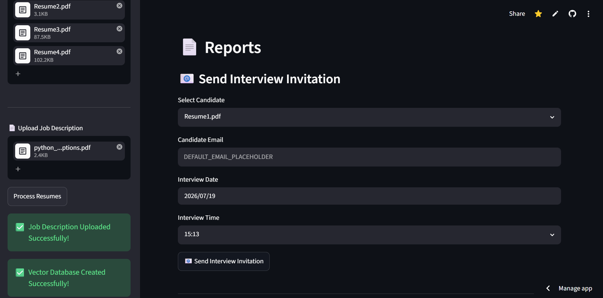
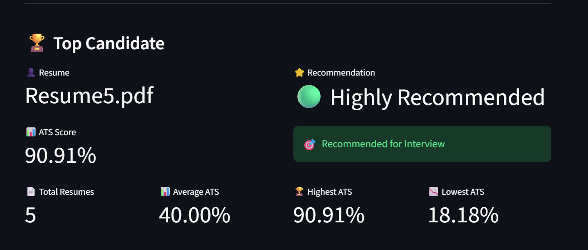
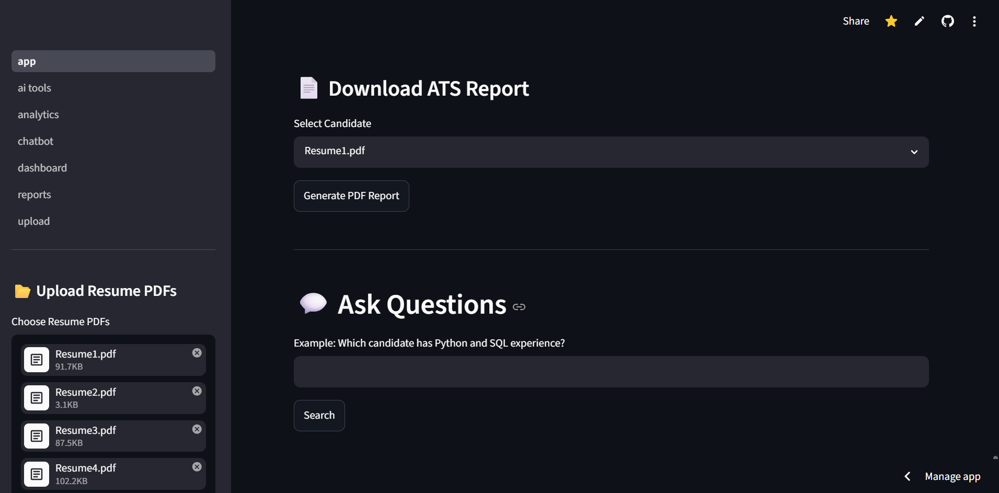

# 🤖 AI Resume Screening & Recruitment Assistant

An AI-powered Resume Screening System that helps recruiters automatically analyze resumes, calculate ATS scores, generate interview questions, evaluate candidates using LLMs, and send interview invitations.

---

# 🚀 Features

- 📄 Resume Parsing (PDF)
- 🎯 ATS Score Calculation
- 🧠 AI Candidate Evaluation
- 🎤 AI Interview Question Generation
- 📊 Skill Matching
- 📑 PDF Report Generation
- 📧 Email Interview Invitation
- 🔍 Resume Search & Filtering
- 🤖 Google Gemini Integration
- ⚡ FAISS Vector Search
- 🌐 Streamlit Web Application

---

## 📸 Screenshots

### Home Page



## 📄 Job Description Upload



## 👤 Candidate Dashboard



## 📑 Candidate Resume




## 📊 ATS Score Visualization



## 📈 ATS Score Comparison



---

### Candidate Analysis


---

### AI Tools



---

### Reports



## 🏆 Top Candidate



## 💬 User Queries



# 🛠️ Tech Stack

Frontend
- Streamlit

Backend
- Python

AI
- Google Gemini
- LangChain

Vector Database
- FAISS

Embeddings
- HuggingFace Sentence Transformers

Libraries
- PyMuPDF
- Pandas
- ReportLab
- dotenv

---

# 📂 Project Structure

```
AI-Resume-Screening-System
│
├── app.py
├── src/
├── pages/
├── utils/
├── reports/
├── assets/
├── data/
├── requirements.txt
└── README.md
```

---

# ⚙️ Installation

Clone the repository

```bash
git clone https://github.com/roniarosariosamk/AI-Resume-Screening-System.git
```

Go into the project

```bash
cd AI-Resume-Screening-System
```

Install dependencies

```bash
pip install -r requirements.txt
```

Run the application

```bash
streamlit run app.py
```

---

# 🔑 Environment Variables

Create a `.env` file:

```
GOOGLE_API_KEY=your_api_key
EMAIL=your_email@gmail.com
APP_PASSWORD=your_app_password
```

---

# ✨ Future Enhancements

- AI Resume Chat
- Candidate Ranking
- Recruiter Dashboard
- Database Integration
- Multi-user Authentication
- Docker Deployment

---

# 👨‍💻 Author

**Ronia Rosario Sam K**

B.Tech – Artificial Intelligence & Data Science

GitHub:
https://github.com/roniarosariosamk

---

# ⭐ If you found this project useful, consider giving it a star!

[def]: E:\ragbot\RAGBOT\ragbot\src\assets\home.png